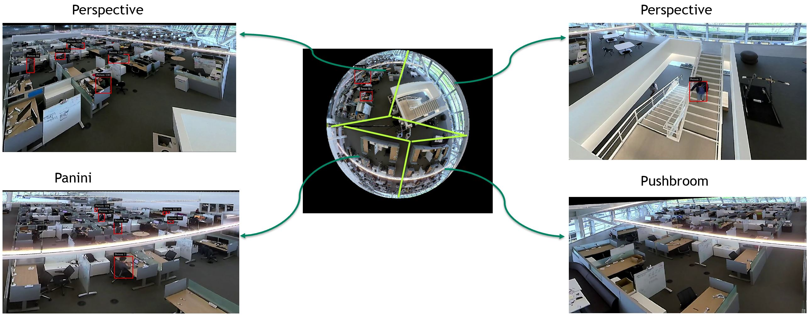

# Deepstream Dewarper App

This project demonstrate how to infer and track from a 360 videos by using the dewarper plugin. 
Dewarping the 360 videos helps to have better inference and tracking accuracy. 
It also includes a dynamic library libnvdsgst_dewarper.so which has more projection types than the libnvdsgst_dewarper.so file in the DeepStream 5.1 

## Prequisites:

Please follow instructions in the apps/sample_apps/deepstream-app/README on how
to install the prequisites for Deepstream SDK, the DeepStream SDK itself and the
apps.

- You must have the following development packages installed

   GStreamer-1.0
   GStreamer-1.0 Base Plugins
   GStreamer-1.0 gstrtspserver
   X11 client-side library

- To install these packages, execute the following command:

   sudo apt-get install libgstreamer-plugins-base1.0-dev libgstreamer1.0-dev \
   libgstrtspserver-1.0-dev libx11-dev

- Replace the libnvds_dewarper.so binary in /opt/nvidia/deepstream/deepstream-5.1/lib/ 
with the binary provided in this repo under the plugin_libraries

## Getting started:

   1. Install [Deepstream 5.1](https://developer.nvidia.com/deepstream-sdk) on your platform, verify it is working by running deepstream-app.
   
   2. Clone the repository preferably in $DEEPSTREAM_DIR/sources/apps/sample_apps.
      
      $ git clone https://github.com/NVIDIA-AI-IOT/Deepstream-Dewarper-App.git 
   3. Replace old dewarper plugin binary with the new binary that includes 15 more projection types. Note: keep the old ones incase you want to revert back and use them 
      - Replace the libnvds_dewarper.so binary in /opt/nvidia/deepstream/deepstream-5.1/lib/ with the binary provided in this repo under the plugin_libraries
      - Replace the libnvdgst_dewarper.so binary in /opt/nvidia/deepstream/deepstream-5.1/lib/gst-plugins/ with the binary provided in this repo under the plugin_libraries
      - Replace the nvds_dewarper_meta.h file in /opt/nvidia/deepstream/deepstream-5.1/source/includes/ 
      
   4. Get the Tlt peoplenet model and label file. Download these files under [inference_files](inference_files/) directory. 
      $ wget https://api.ngc.nvidia.com/v2/models/nvidia/tlt_peoplenet/versions/pruned_v2.1/files/resnet34_peoplenet_pruned.etlt
      $ wget https://api.ngc.nvidia.com/v2/models/nvidia/tlt_peoplenet/versions/pruned_v2.1/files/labels.txt
      The models described in this card detect one or more physical objects from three categories within an image and return a box around each object, as well as a category           label for each object. Three categories of objects detected by these models are – persons, bags and faces.
      Please visit https://ngc.nvidia.com/catalog/models/nvidia:tlt_peoplenet for details. 
   5. Compile the program
   
      - $ cd deepstream-dewarper-app/
      - $ make
      - $ ./deepstream-dewarper-app [1:file sink|2: fakesink|3:display sink] [1:without tracking| 2: with tracking] [<uri1> <camera_id1>] [<uri2> <camera_id2>] ... [<uriN> <camera_idN>]
      - Single Stream
      - $ ./deepstream-dewarper-app 3 1 file:///home/nvidia/sample_office.mp4 6 one_config_dewarper.txt
      - // Single Stream for Perspective Projection type (needs config file change)
      - $ ./deepstream-dewarper-app 3 1 file:///home/nvidia/yoga.mp4 0
      - Multi Stream
      - $ ./deepstream-dewarper-app 3 1 file:///home/nvidia/sample_cam6.mp4 6 file:///home/nvidia/sample_cam6.mp4 6

    
 
The following description focus on the default use-case of detecting people in a cubicle office enviroment  but you can use it to test other
types of applications that needs the dewarper functionality. 

(see Note below).
For more information on the general functionality and further examples see the
DeepStream Plugin Development Guide.

Dewarping configuration files are provided in [dewarper_config_files](dewarper_config_files/) directory :
   - Example parameters for dewarping fisheye camera/video are given in these config files. You can play with these parameters to get your desired dewarped surface.
   - Details explaining these parameters are given below in this file.. 

Parameters:
uri - represents the input video stream

The dewarping parameters for the given camera can be configured in the config file provided 
to generate dewarp surfaces
input video stream.

Note:
gst-nvdewarper plugin uses "VRWorks 360 Video SDK".
For further details please refer to https://developer.nvidia.com/vrworks/vrworks-360video/download

For description of general dewarper parameters please visit the DeepStream
Plugin Development Guide.

-------------------------------

--------------
Common Fields
--------------
Please refer to [GST-NVDEWARPER configuration file parameters](https://docs.nvidia.com/metropolis/deepstream/5.0DP/plugin-manual/index.html#page/DeepStream%20Plugins%20Development%20Guide/deepstream_plugin_details.3.08.html) for details. 

- projection-type - Selects projection type. With the new plugin update (binary files you replaced) 15 more projection types are added. 
                  New projection types added are : 
                  - 1=PushBroom, 2=VertRadCyl 3= Perspective_Perspective FISH_PERSPECTIVE=4, FISH_FISH=5, FISH_CYL=6, FISH_EQUIRECT=7,
                   FISH_PANINI=8, PERSPECTIVE_EQUIRECT=9, PERSPECTIVE_PANINI=10, EQUIRECT_CYLINDER=11, EQUIRECT_EQUIRECT=12 EQUIRECT_FISHEYE=13,
                   EQUIRECT_PANINI=14, EQUIRECT_PERSPECTIVE=15, EQUIRECT_PUSHBROOM=16, EQUIRECT_STEREOGRAPHIC=17, EQUIRECT_VERTCYLINDER=18
- top-angle - Top Field of View Angle, in degrees
- bottom-angle - Bottom Field of View Angle, in degrees
- pitch	- Viewing parameter Pitch, in degrees
- yaw	- Viewing parameter Yaw, in degrees
- roll - Viewing parameter Roll, in degrees
- focal length	- Focal Lenght of camera lens, in pixels per radian
- width	- dewarped surface width
- height - dewarped surface height
- num-batch-buffers - To change the number of surfaces. It should match the number of "surfaces" groups in the configuration file. So if you want two surfaces per buffer you    should have "num-batch-buffers"=2 and two surfaces groups ([surface0] and [surface1]). Default value is 4.

 
